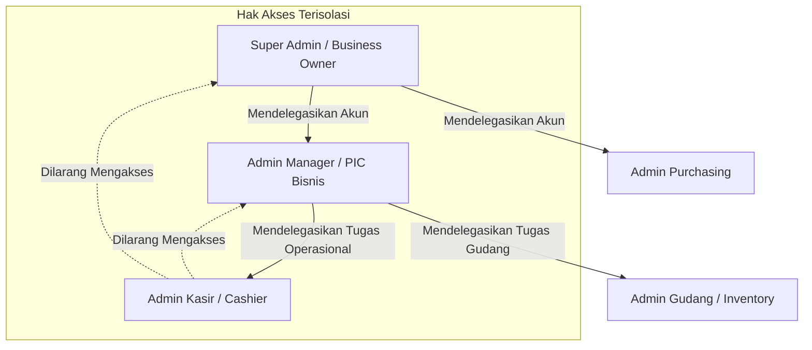
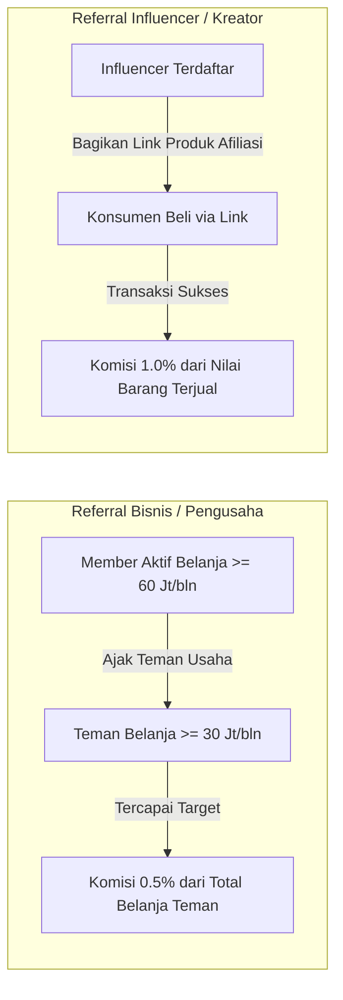
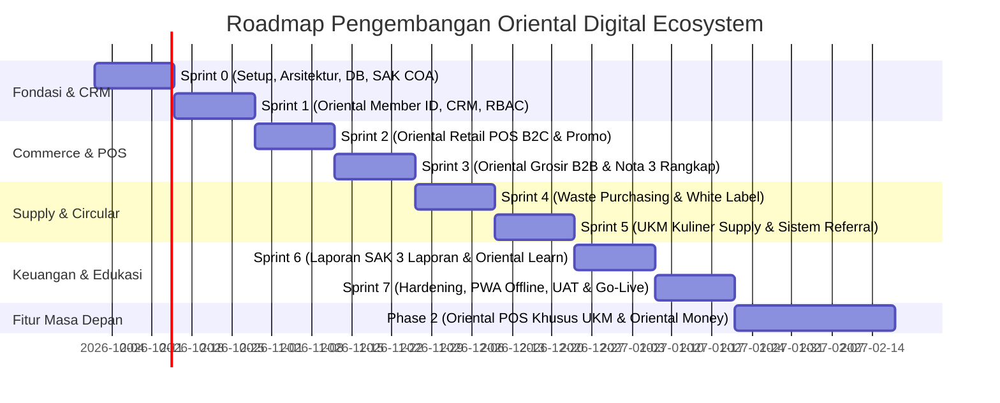

# PRODUCT REQUIREMENTS DOCUMENT (PRD)
## PROJECT ORIENTAL DIGITAL ECOSYSTEM

| Metadata | Keterangan |
| :--- | :--- |
| **Nama Dokumen** | Product Requirements Document (PRD) - Oriental Ecosystem |
| **Versi Dokumen** | 1.0.0 (Comprehensive Release) |
| **Status** | Approved for Development Planning |
| **Arsitektur Utama** | Progressive Web App (PWA) - Responsive Web & Android Wrapper |
| **Standar Kepatuhan** | Standar Akuntansi Keuangan (SAK) Indonesia |
| **Target Pengguna** | B2C (Konsumen Retail), B2B (Grosir, UKM Kuliner, Hotel, Cafe, Resto), Mitra Waste, Vendor White Label, Influencer |

---

## 1. Executive Summary & Visi Produk

### 1.1 Visi
Membangun ekosistem digital terintegrasi *end-to-end* yang menghubungkan seluruh rantai nilai perdagangan lokal: mulai dari ritel B2C modern, distribusi grosir B2B, rantai pasok UKM kuliner terfragmentasi, kemitraan manufaktur *white label*, pengelolaan ekonomi sirkular (*waste purchasing*), hingga portal edukasi dan sistem finansial/akuntansi terstandarisasi SAK.

### 1.2 Masalah yang Diselesaikan
1. **Fragmentasi Data Konsumen:** Pelaku usaha dan konsumen berinteraksi di berbagai channel tanpa identitas tunggal (*siloed customer data*).
2. **Ketiadaan Standarisasi Multi-Channel POS:** Kasir retail swalayan, kasir grosir partai besar (membutuhkan nota 3 rangkap), dan drop-point daur ulang membutuhkan sistem transaksi yang berbeda namun harus tersinkronisasi dalam satu buku besar inventori dan akuntansi.
3. **Inefisiensi Supply Chain UKM Kuliner:** UKM kesulitan mendapatkan harga bertingkat yang transparan dan pasokan stabil sesuai skala bisnis mereka (Warung vs Cafe vs Hotel).
4. **Minimnya Insentif Loyalitas Terintegrasi:** Belum ada program loyalitas yang mengonversi aktivitas belanja, suplai grosir, hingga penjualan limbah menjadi poin terpadu dan kupon undian doorprize transparan.

---

## 2. Arsitektur Peran & Model Delegasi (RBAC)

Sistem mengadopsi struktur otorisasi hierarkis bertingkat (*Multi-tiered Role-Based Access Control*):



### 2.1 Definisi Peran (Roles)
1. **Super Admin (Owner / Pemilik Usaha Terdaftar):**
   - Hak mutlak akun induk perusahaan/badan usaha.
   - Mengelola langganan, profil legalitas usaha, rekening bank utama, dan laporan keuangan komprehensif.
   - Berhak mendelegasikan dan mencabut hak user **Admin** (Manager, Purchasing, Finansial).
2. **Admin Manager / PIC Bisnis:**
   - Didelegasikan oleh Super Admin untuk mengelola operasional harian.
   - Berhak mendelegasikan peran bawahan (**Admin Kasir**, **Operator Waste**, **Staff Gudang**).
   - Melihat laporan penjualan shift, setoran kasir, dan penyesuaian stok.
3. **Admin Purchasing:**
   - Mengelola pemesanan barang ke Oriental Grosir, UKM Kuliner Supply Chain, dan vendor White Label.
   - Mengontrol penerimaan barang (*Purchase Order* & *Goods Receipt*).
4. **Admin Kasir (Sub-Admin Terisolasi):**
   - Hanya memiliki akses ke antarmuka POS (buka/tutup shift kasir, scan barcode, cetak struk/nota, input member ID).
   - **Strict Isolation:** Tidak dapat melihat laporan laba/rugi, harga modal (HPP), data rahasia supplier, maupun delegasi user lain.

---

## 3. Spesifikasi Rinci Modul Produk

### 3.1 Oriental Member ID (CRM & Big Data Customer)
Platform identitas tunggal (*Customer One Identity*) untuk merekam profil, histori belanja, dan akumulasi poin ekosistem.

* **Format Identitas:** Barcode & QR Code digital yang dapat diakses melalui PWA customer atau dicetak pada kartu fisik.
* **Mesin Konversi Poin Transaksi (Loyalty Points Engine):**
  | Channel Transaksi | Aturan Konversi Poin | Keterangan |
  | :--- | :--- | :--- |
  | **Retail (B2C)** | Rp 100.000 = 1 Poin | Dihitung kelipatan transaksi bersih |
  | **UKM Supply Kuliner** | Rp 50.000 = 1 Poin | Skim insentif khusus pelaku usaha kuliner |
  | **Grosir (B2B)** | Rp 200.000 = 1 Poin | Transaksi volume besar/partai |
  | **Waste Purchasing** | 1 Kilogram = 1 Poin | Berdasarkan total berat timbangan valid |
  | **White Label** | Rp 10.000 = 1 Poin | Kemitraan produksi manufaktur |
* **Sistem Kupon Doorprize Otomatis:**
  - Setiap akumulasi transaksi kelipatan **Rp 150.000** menerbitkan secara otomatis **1 Nomor Kupon Undian Doorprize**.
  - Kupon tersimpan di dompet digital Member ID dan terarsip dalam database pengundian berkala.
* **Log History Poin & Mutasi Transaksi Member:**
  - Riwayat lengkap pencatatan setiap perolehan (+Poin) maupun penukaran (-Poin).
  - Menyimpan nomor invoice transaksi, channel belanja (Retail, Grosir, Waste, dsb.), tanggal/jam, nominal belanja, dan penerbitan nomor kupon doorprize.
* **Customer One Identity Form:**
  - NIK/KTP (opsional untuk B2B/pajak), Nama Lengkap, No. WhatsApp (verifikasi OTP), Email, Alamat Lengkap, Jenis Usaha (jika B2B).
* **Big Data & Customer Profiling:**
  - Segmentasi otomatis: Frekuensi belanja (RFM Analysis), total basket size mingguan/bulanan, preferensi kategori produk.

---

### 3.2 Oriental Retail (Point of Sale B2C)
Aplikasi kasir modern berkecepatan tinggi yang dirancang untuk pengalaman belanja layaknya minimarket/swalayan terkemuka.

* **Target Segmen:** B2C, Ibu Rumah Tangga, Konsumen Umum.
* **Platform:** Progressive Web App (PWA) yang responsif untuk Desktop Kasir, Tablet, dan Mobile Android.
* **Fitur Utama:**
  - **Scan Barcode Otomatis:** Deteksi pemindaian otomatis seketika barcode produk terbaca oleh hardware scanner (laser USB/Bluetooth) tanpa mengharuskan kasir menekan tombol klik atau Enter.
  - **Akses Harga Retail:** Mengambil basis harga eceran secara otomatis.
  - **Identifikasi Member Instan:** Scan barcode member via smartphone pelanggan; menampilkan nama, saldo poin terakumulasi, dan kupon doorprize aktif.
  - **Validasi Pembayaran & Kembalian (Anti-Minus):**
    - Nilai kembalian tidak boleh minus jika nominal yang dibayarkan kurang dari total belanja.
    - Tombol checkout terkunci jika dana belum mencukupi dan sistem menampilkan nominal kekurangan uang secara jelas (*"Uang Kurang: Rp X"*).
    - Proses transaksi tidak dapat diselesaikan dengan nilai minus.
  - **Multi-UoM & Varian Satuan Bertingkat (SKU Turunan):**
    - Setiap produk dapat memiliki beberapa varian ukuran/satuan (contoh: 1 Dos Indomie Goreng = 24 bungkus; 1 Karton Minyak Goreng = 6 pouch).
    - Tiap satuan merupakan turunan resmi dari SKU / Unik_ID produk induk (contoh: Indomie `SKU-IND-001`, varian bungkus `SKU-IND-001-BKS` dengan barcode sendiri, varian dos `SKU-IND-001-DOS` dengan barcode sendiri).
    - **Pengurangan Stok Otomatis Pecahan (*Fractional Stock Breakdown*):**
      - Seluruh inventori disimpan dalam basis satuan terkecil (*base unit*).
      - *Contoh Transaksi:* Stok awal 1 dos Indomie Goreng (24 bungkus). Jika pelanggan membeli secara eceran sebanyak 2 bungkus, sistem secara otomatis mengonversi dan menampilkan sisa stok menjadi: **0 dos 22 bungkus**.
  - **Sesi Keranjang Kasir Persisten (*Persistent Cart Session*):**
    - Keranjang belanja kasir tetap tersimpan utuh dan tidak kembali ke nilai default saat kasir berpindah antar menu/tab (Retail, Grosir, Member, Akuntansi).
    - Keranjang hanya dikosongkan (*clear*) saat transaksi telah berhasil diselesaikan (*checkout success*) atau saat kasir secara sengaja menekan tombol "Hapus Semua".
  - **Auto-Clear Keranjang Belanja:** Keranjang belanja (*cart*) otomatis dikosongkan seketika transaksi sukses dan struk diterbitkan, siap memproses antrean berikutnya.
  - **Promo Retail Engine:** Potongan harga langsung (*flash sale*), beli 2 gratis 1 (*bundle*), diskon kupon, voucher poin member.
  - **Metode Pembayaran:** Tunai (dengan validasi uang pas & nominal pecahan cepat), QRIS Dinamis, Transfer Bank, Kartu Debit/EDC.
  - **Struk Digital & Thermal:** Cetak via printer thermal 58mm/80mm serta opsi pengiriman e-receipt via WhatsApp.

---

### 3.3 Oriental Grosir (Point of Sale B2B)
Sistem kasir dan order fulfilment untuk penjualan partai besar dan grosir berulang.

* **Target Segmen:** B2B, Toko Frozen Food, Toko Plastik, Agen Sembako, Reseller.
* **Platform:** Web PWA / Android.
* **Fitur Utama:**
  - **Akses Harga Grosir Bertingkat:** Skema harga kuantitas (*Tiered Pricing*: Dus, Bal, Karton, Palet).
  - **Cetak Nota 3 Rangkap Standar (Dot Matrix / Continuous Form):**
    - **Nota 1 (Lembar 1 - Putih):** Jika pembayaran secara **CASH**, diserahkan kepada pembeli sebagai **Bukti Pembayaran Lunas Sah**.
    - **Nota 2 (Lembar 2 - Kuning):** Jika pembayaran secara **TERMIN / KREDIT**, diserahkan kepada pembeli sebagai **Faktur Tagihan Piutang (TOP)**.
    - **Nota 3 (Lembar 3 - Biru):** Disimpan sebagai **Arsip Pembukuan Perusahaan** dan dasar penjurnalan akuntansi SAK.
  - **Identifikasi Akun B2B:** Scan kartu barcode atau input Nama Badan Usaha / Toko.
  - **Promo Grosir:** Potongan diskon kuantum tonase/karton, syarat pembayaran termin (TOP - *Terms of Payment* bagi member terverifikasi).
  - **Integrasi Stok Gudang:** Penguncian stok (*stock hold*) saat order dibuat sebelum diteruskan ke checker gudang.

---

### 3.4 Oriental Waste Purchasing (Reverse Logistics & Circular Economy)
Sistem pencatatan transaksi pembelian dan penampungan produk daur ulang / limbah bernilai ekonomis (minyak jelantah, kardus, plastik daur ulang, dll).

* **Model Bisnis:** *Revenue / Profit Sharing* antara Oriental Ecosystem dengan Penyedia Tempat (Mitra Drop Point / Gudang Transit).
* **Fitur Utama:**
  - **Dynamic Pricing Engine:** Harga beli per kg dapat diperbarui secara dinamis mengikuti fluktuasi harga komoditas pasar atau kesepakatan mitra.
  - **Universal Access:** Terbuka bagi semua kategori customer (retail, warung, hotel, maupun pemulung/pengepul mandiri).
  - **Pencatatan Penimbangan Digital:** Input berat (kg), foto bukti timbangan, pengecekan kadar kotoran/kualitas limbah.
  - **Pemberian Poin Otomatis:** Menghitung 1 Poin Member per 1 kg limbah yang disetorkan.
  - **Kalkulasi Bagi Hasil Penyedia Tempat:**
    - Perhitungan otomatis margin kotor = `(Harga Jual ke Pabrik Pengolah - Harga Beli dari Penyetor) x Volume (Kg)`.
    - Pembagian persentase bagi hasil (*Profit Sharing %*) sesuai kontrak mitra penyedia tempat, tercatat otomatis pada buku utang mitra.

---

### 3.5 Oriental UKM Kuliner Supply Chain
Portal B2B e-procurement khusus pelaku usaha kuliner untuk memesan bahan baku rutin dengan harga khusus industri.

* **Segmentasi Kategori Usaha Kuliner:**
  1. *Hotel* (Standar volume & spesifikasi premium, faktur pajak resmi).
  2. *Restaurant* (Volume medium-high, pengiriman terjadwal harian).
  3. *Café* (Bahan baku spesifik bakery, dairy, sirup, kopi).
  4. *Coffeeshop* (Kebutuhan susu, beans, packaging cup, es batu).
  5. *Warung Makan / Kuliner Kaki Lima* (Bahan pokok harian, harga ekonomis).
* **Fitur Utama:**
  - **Dynamic Pricing per Segment:** Setiap akun yang login melihat katalog harga yang sesuai dengan kategori terverifikasinya.
  - **Promo Khusus B2B Kuliner:** Diskon *standing order* mingguan, subsidi ongkos kirim armada Oriental, paket bundling bahan baku.
  - **Jadwal Pengiriman Berulang (Recurring Delivery Order):** Penjadwalan pengiriman otomatis untuk menjaga stok dapur mitra.

---

### 3.6 Oriental White Label (Mitra Produksi & Pabrikasi)
Modul kemitraan strategis dengan vendor pabrikan dan UMKM produsen untuk memproduksi barang dengan merek khusus (*custom branding*).

* **Alur Kerja Kemitraan:**
  - Registrasi & Seleksi Legalitas Vendor / Pabrik Pihak Ketiga (PIRT, BPOM, Halal).
  - Perjanjian Kontrak Maklon & Standar Kontrol Mutu (SLA Quality Control).
  - Penerbitan *Purchase Contract*, pelacakan *Batch Production*, dan *Goods Receipt Note* (GRN).
* **Poin Loyalitas Kemitraan:** Konversi Rp 10.000 nilai transaksi produksi = 1 Poin Member ID.

---

### 3.7 Oriental Learn (Portal Edukasi & Sertifikasi)
Platform pembelajaran terpadu untuk memberdayakan pemilik usaha, barista, koki, dan kasir member ekosistem.

* **Modalitas:** Pelatihan *Online* (video materi mandiri, kuis interaktif) dan *Offline* (workshop tatap muka, sertifikasi kompetensi).
* **Fitur Utama:**
  - **Katalog Kursus Digital:** Video tutorial pengelolaan HPP, teknik seduh kopi, higienitas dapur, strategi pemasaran warung.
  - **Jadwal Pelatihan Offline:** Registrasi tempat duduk (*seat booking*), tiket QR presensi kehadiran di lokasi training center Oriental.
  - **Sistem Ujian & Kuis:** Evaluasi pemahaman materi dengan penilaian otomatis.
  - **E-Sertifikat Terverifikasi:** Penerbitan sertifikat digital dengan kode verifikasi unik setelah lulus ujian.

---

### 3.8 Sistem Referral & Afiliasi Ganda

Sistem komisi dua pilar untuk menggerakkan pertumbuhan eksponensial pengguna:



#### A. Tipe 1: Referral Bisnis / Pengusaha
* **Tujuan:** Mendorong akuisisi merchant B2B grosir dan supply kuliner berskala besar.
* **Mekanisme Tautan:** Member aktif membagikan **tautan profil pendaftaran akun user/member dia** (`https://oriental.co.id/register-merchant?ref=[MEMBER_CODE]`). Rekan yang mendaftar melalui tautan tersebut akan terhubung permanen sebagai referee.
* **Syarat Pengusul (Referrer):** Member aktif Oriental dengan akumulasi belanja pribadi minimal **Rp 60.000.000 / bulan**.
* **Syarat Rekanan (Referee):** Member baru yang diajak harus aktif bertransaksi minimal **Rp 30.000.000 / bulan**.
* **Keuntungan / Komisi:** Referrer mendapatkan reward tunai/saldo sebesar **0.5%** dari total nominal transaksi yang dibukukan oleh rekanan yang direferensikan setiap bulannya.

#### B. Tipe 2: Referral Influencer
* **Tujuan:** Mendorong omset retail B2C dan produk viral melalui kanal media sosial.
* **Mekanisme Tautan:** Influencer membagikan **tautan produk spesifik yang ingin dipromosikan** (`https://oriental.co.id/product/[SLUG]?aff=[MEMBER_CODE]&pid=[PRODUCT_ID]`).
* **Keuntungan / Komisi:** Mendapatkan komisi langsung sebesar **1.0%** dari total nominal penjualan atas produk spesifik yang berhasil terjual melalui tautan promosi tersebut.
* **Dashboard Afiliasi:** Papan pemantau klik link, rasio konversi (*conversion rate*), total komisi tertahan (*pending*), dan penarikan komisi (*payout*).

---

### 3.9 Modul Finansial & Akuntansi Kepatuhan SAK (Standar Akuntansi Keuangan)

Sistem memproduksi secara **live, otomatis, dan real-time** sedikitnya **3 Laporan Keuangan Pokok SAK** yang nilainya langsung bergerak setiap kali transaksi kasir selesai:

1. **Laporan Laba Rugi (Statement of Profit or Loss - Live Update):**
   - Pendapatan Penjualan Bersih bergerak live (Retail, Grosir, Supply Chain, Waste, White Label).
   - Beban Pokok Pendapatan (HPP / Cost of Goods Sold) terpotong otomatis dari persediaan.
   - Beban Operasional (Gaji, Transportasi Armada, Biaya Promo/Komisi Referral, Bagi Hasil Waste).
   - Laba Kotor, Laba Usaha, dan Laba Bersih Tahun/Bulan Berjalan terhitung secara instan.
2. **Laporan Posisi Keuangan / Neraca (Statement of Financial Position - Prinsip Keseimbangan SAK):**
   - **Aset:** Aset Lancar (Kas & Setara Kas bertambah saat tunai; Piutang Dagang/TOP bertambah saat transaksi grosir kredit; Persediaan Barang Dagang terpotong live), Aset Tetap.
   - **Liabilitas:** Utang Dagang Usaha, Utang Bagi Hasil Mitra Tempat Waste, Utang Komisi Referral, Beban Akrual.
   - **Ekuitas:** Modal Pemilik, Saldo Laba Ditahan & Laba Berjalan.
   - **Keseimbangan SAK:** Garansi absolut `Total Aset == Total Liabilitas + Ekuitas`.
3. **Laporan Arus Kas (Statement of Cash Flows - Metode SAK):**
   - Arus Kas dari Aktivitas Operasi (Penerimaan kas pelanggan, pembayaran ke supplier).
   - Arus Kas dari Aktivitas Investasi (Pembelian peralatan gudang/mesin).
   - Arus Kas dari Aktivitas Pendanaan (Prive modal, pinjaman usaha).
4. **Buku Besar & Jurnal Otomatis (General Ledger & Double-Entry Bookkeeping):**
   - Setiap transaksi POS, pembelian waste, komisi referral, dan penerimaan stok gudang secara otomatis membentuk jurnal debet-kredit sesuai bagan akun (*Chart of Accounts - COA*).

---

### 3.10 Fitur Masa Depan (Next Phase Features)

#### A. Oriental POS Khusus UKM (SaaS Berlangganan)
* **Aplikasi POS Kasir Standalone** untuk outlet restoran/kafe mitra UKM.
* **Dynamic QRIS Generator:** Menghasilkan QRIS dinamis unik per transaksi pembayaran di meja kasir.
* **Recipe Costing & HPP Management:** Menghitung biaya resep per menu (misal: 1 cangkir kopi latte = 18g espresso + 150ml susu + 1 cup plastik + sedotan) dan memotong bahan baku per penjualan.
* **Buffer Stock Auto-Notification & Reorder:** Peringatan saat stok bahan baku mendekati batas aman, dengan tombol langsung order ke **Oriental UKM Supply / Grosir**.
* **Model Monetisasi:** Paket langganan bulanan/tahunan (*SaaS Subscription*).

#### B. Oriental Money (Dompet Digital Ekosistem)
* Uang elektronik tertutup/terbuka (*closed-loop/open-loop e-wallet*) seperti GoPay/OVO.
* Penyimpanan saldo instan untuk pencairan komisi referral, saldo belanja member, dan penerimaan pembayaran daur ulang limbah secara *cashless*.

---

## 4. Arsitektur Teknis, Rekomendasi Tech Stack & NFR

### 4.1 Diagram Arsitektur Sistem

```mermaid
graph TD
    subgraph Client Layer (PWA & Hardware)
        PWA[React PWA / Android Webview]
        IDB[(Dexie.js - IndexedDB Offline Cache)]
        PWA <--> IDB
        PWA -->|Web Bluetooth / Web Serial| TP[Thermal Printer 58/80mm]
        PWA -->|QZ Tray / Raw ESC/P| DMP[Dot Matrix Printer - Nota 3 Rangkap]
        PWA -->|HID / Camera| BC[Barcode & QR Scanner]
    end

    subgraph API & Application Layer
        GW[API Gateway / Reverse Proxy Nginx]
        PWA <-->|REST API / WebSocket| GW
        BE[NestJS Backend Services - TypeScript]
        GW --> BE
        QUEUE[BullMQ Background Queue]
        BE --> QUEUE
    end

    subgraph Data & Persistence Layer
        DB[(PostgreSQL 16+ Primary - ACID / SAK Ledger)]
        CACHE[(Redis - Cache, Session & Queue Store)]
        S3[(Object Storage - Cloudflare R2 / AWS S3)]
        BE <--> DB
        BE <--> CACHE
        QUEUE <--> CACHE
        BE --> S3
    end

    subgraph Third-Party Integrations
        WA[WhatsApp Gateway - OTP & E-Receipt]
        PAY[QRIS Dynamic Payment Provider]
        BE --> WA
        BE --> PAY
    end
```

### 4.2 Rekomendasi Tech Stack Utama (Enterprise-Grade)

| Komponen Arsitektur | Teknologi Terpilih | Justifikasi & Kesesuaian Terhadap PRD |
| :--- | :--- | :--- |
| **Frontend Framework** | **React 18/19 + Vite + TypeScript** | Sangat ringan, performa render tinggi, arsitektur berbasis komponen memudahkan standarisasi UI kasir & dashboard manajemen. |
| **PWA & Offline Engine** | **Vite PWA Plugin + Dexie.js (IndexedDB)** | Wajib untuk kasir Retail: kasir tetap dapat memindai barang dan mencetak struk secara offline saat koneksi toko terputus (*zero downtime*). |
| **UI Library & Styling** | **TailwindCSS + Shadcn UI** | Komponen UI modern, fleksibel, responsif untuk layar sentuh kasir (10"–15"), mobile Android, maupun desktop backoffice. |
| **Backend Core** | **NestJS (Node.js / TypeScript)** | Arsitektur modular enterprise (Domain-Driven Design). Memisahkan modul CRM, POS, Grosir, Waste, Referral, dan Akuntansi secara rapi dan terisolasi. |
| **Database Utama** | **PostgreSQL 16+** | **Kepatuhan SAK mensyaratkan garansi ACID mutlak**. PostgreSQL menjamin integritas transaksi finansial (*double-entry*), *row-level locking* untuk stok barang, dan audit trail yang tidak dapat diubah (*tamper-proof*). |
| **ORM / Data Access** | **Prisma ORM / TypeORM** | Skema data *type-safe*, migrasi database terkelola rapi, dan mencegah *syntax error* pada kalkulasi finansial. |
| **Queue & Background Jobs** | **Redis + BullMQ** | Menjalankan perhitungan komisi referral, konversi poin 5 segmen, pencetakan kupon undian doorprize, dan notifikasi WA di latar belakang agar kasir tidak mengalami *latency/lag*. |
| **Cetak Nota 3 Rangkap (Grosir)** | **QZ Tray (Raw ESC/P Socket Service)** | Mengirim instruksi teks mentah ke printer dot matrix continuous form (misal Epson LX-310) tanpa terganggu oleh dialog cetak bawaan browser. |
| **Cetak Struk Thermal (Retail)** | **Web Serial API / Web Bluetooth API** | Integrasi langsung dari browser PWA ke printer kasir 58mm/80mm tanpa instalasi driver rumit. |
| **Media & Video LMS (Oriental Learn)** | **Cloudflare Stream / AWS S3 + CDN** | Streaming video modul edukasi adaptif (HLS) dengan proteksi akses berlisensi member. |
| **WhatsApp Gateway** | **Fonnte / Waha (WhatsApp API Engine)** | Otomatisasi pengiriman OTP verifikasi pendaftaran member dan pengiriman e-receipt nota belanja langsung ke HP pelanggan. |

### 4.3 Rekomendasi Tech Stack Alternatif (Rapid Development)
Jika perusahaan mengutamakan **kecepatan rilis (*Time-to-Market*)** dengan jumlah tim pengembang yang lebih ringkas:
* **Monolith Stack:** **Laravel 11 (PHP 8.3) + Inertia.js + Vue.js/React + PostgreSQL**.
* *Kelebihan:* Sangat cepat untuk scaffolding modul CRUD, administrasi backoffice, manajemen antrean (Laravel Horizon), dan pelaporan PDF akuntansi.
* *Catatan:* Perlu penanganan Service Worker manual yang lebih teliti untuk fitur PWA kasir *offline-first*.

### 4.4 Matriks Kesesuaian Kebutuhan PRD vs Solusi Teknologi

| Kebutuhan PRD | Solusi Teknologi Terpilih |
| :--- | :--- |
| **Kasir B2C Cepat & Swalayan** | React PWA + IndexedDB (*Zero Latency Search* & Shortcut Keyboard) |
| **Pencetakan Nota 3 Rangkap (B2B)** | QZ Tray / Raw ESC/P Socket Service (Khusus dot-matrix continuous form) |
| **Akuntansi Standar SAK (3 Laporan)** | PostgreSQL Transactions (ACID) + Ledger Engine (*Double-Entry*) |
| **Delegasi Role (Owner $\rightarrow$ Manager $\rightarrow$ Kasir)** | NestJS Guards + CASL (Attribute-Based Access Control) |
| **Poin & Kupon Doorprize Otomatis** | BullMQ Event-Driven Worker (Dipicu setiap event `ORDER_COMPLETED`) |
| **Katalog Multi-Harga (Hotel/Cafe/Warung)** | Redis Cache Layer per User Segment ID |
| **Pelatihan Video Oriental Learn** | HLS Video Streaming via Cloudflare Stream / Mux |

### 4.5 Persyaratan Non-Fungsional (NFR) & Spesifikasi Perangkat Keras

| Kategori | Spesifikasi & Standar |
| :--- | :--- |
| **Arsitektur Front-End** | Progressive Web App (PWA) dengan Service Worker untuk kemampuan *offline caching* kasir retail. |
| **Responsivitas Perangkat** | Desain fleksibel untuk Desktop Layar Lebar (Backoffice & POS Grosir), Layar Kasir POS (Touchscreen 10"-15"), dan Ponsel Android/iOS. |
| **Konektivitas Hardware POS** | Integrasi ESC/POS thermal printer (Bluetooth, USB, Network LAN) dan barcode scanner hardware via WebUSB/HID API. |
| **Dukungan Nota Fisik** | Kompatibilitas pencetakan Dot Matrix (*Continuous Paper* 9.5 x 11 inch / Rangkap 3) menggunakan *raw text ESC/P formatting*. |
| **Performa & Kecepatan** | Respon scan barcode produk < 100ms; pembentukan struk dan jurnal akuntansi < 1 detik. |
| **Keamanan Data** | Enkripsi data saat transit (TLS 1.3) dan rest (AES-256), hashing password Argon2/Bcrypt, role authentication JWT dengan refresh token rotasi. |
| **Kepatuhan Audit** | *Immutable audit trail*: semua transaksi kasir dan jurnal akuntansi tidak dapat dihapus (*no hard-delete*), hanya dapat dilakukan pembatalan (*void*) dengan otorisasi Super Admin/Manager. |

---

## 5. Rencana Rilis Agile & Roadmap Pembagian Sprint

Proyek dirancang dalam skema pengembangan **8 Sprint (2 Minggu per Sprint = 16 Minggu / 4 Bulan)** menuju Minimum Viable Ecosystem (MVE), disusul oleh Fase Lanjutan (*Phase 2*).



---

### Sprint 0: Foundation, Architecture, & Design System (Minggu 1 - 2)
* **Tujuan Sprint:** Menyiapkan infrastruktur dasar cloud, inisialisasi monorepo/repositori NestJS & React PWA, skema database PostgreSQL, struktur Chart of Accounts (COA) akuntansi SAK, dan fondasi UI design system.
* **Deliverables:**
  1. Setup *boilerplate* backend NestJS (TypeScript) + Redis BullMQ dan frontend React (Vite) PWA + TailwindCSS + Shadcn UI.
  2. Perancangan skema database multi-tenant (PostgreSQL 16+) mencakup tabel Entity Master: Users, Members, Products, Multi-Prices, Inventory, Transactions, Accounting Ledger.
  3. Konfigurasi struktur Akun Akuntansi Standar SAK (Aset, Kewajiban, Ekuitas, Pendapatan, HPP, Beban).
  4. Design System UI/UX (Komponen tombol, input form barcode, modal dialog, layout kasir modern).
  5. Setup Docker Compose untuk lingkungan development lokal (PostgreSQL, Redis, MinIO).
* **Acceptance Criteria:**
  - Database schema berhasil di-migrate tanpa relasi konflik.
  - Setup CI/CD pipeline dan container Docker berjalan lancar.

---

### Sprint 1: Oriental Member ID, RBAC Delegation, & Core CRM (Minggu 3 - 4)
* **Tujuan Sprint:** Membangun autentikasi pengguna, manajemen delegasi Super Admin/Admin/Kasir, dan modul registrasi Customer One Identity.
* **Deliverables:**
  1. Autentikasi JWT dengan hak akses hierarki (Super Admin -> Admin Manager -> Admin Kasir).
  2. Modul registrasi dan profil Member One Identity (Form Profil, pembuatan Barcode ID unik, QR generator).
  3. Mesin kalkulator Poin Loyalitas terpusat (Retail, Grosir, UKM Kuliner, Waste, White Label).
  4. Logika otomatis penerbitan Kupon Doorprize kelipatan Rp 150.000.
* **Acceptance Criteria:**
  - Super Admin berhasil mendelegasikan Admin Kasir; Admin Kasir divalidasi tidak bisa mengakses menu manajerial.
  - Scan barcode member ID memunculkan data pelanggan dalam waktu < 200 ms.
  - Simulasi transaksi otomatis menambah poin dan kupon sesuai rumus rasio.

---

### Sprint 2: Oriental Retail POS (B2C) & Promo Engine (Minggu 5 - 6)
* **Tujuan Sprint:** Membangun antarmuka kasir swalayan/retail yang cepat, intuitif, dan mendukung beragam promosi belanja B2C.
* **Deliverables:**
  1. Antarmuka Kasir Swalayan (Katalog grid produk, scanner barcode input, cart management, shortcut keyboard).
  2. Buka/Tutup Shift Kasir dan rekonsiliasi uang kas (*cash drawer*).
  3. Integrasi Promo Retail (Diskon nominal, persentase, Beli X Gratis Y, voucher member).
  4. Modul Pembayaran Multi-Payment (Tunai, QRIS, Kartu) dan integrasi cetak struk thermal 58mm/80mm.
* **Acceptance Criteria:**
  - Kasir dapat menyelesaikan transaksi 10 item dalam waktu < 45 detik.
  - Poin member (Rp 100k = 1 pt) dan kupon undian (Rp 150k = 1 kupon) bertambah secara otomatis pada akun pelanggan yang di-scan.

---

### Sprint 3: Oriental Grosir POS (B2B) & Nota 3 Rangkap (Minggu 7 - 8)
* **Tujuan Sprint:** Mengembangkan modul transaksi grosir partai besar, penetapan harga berjenjang, dan pencetakan nota fisik 3 rangkap.
* **Deliverables:**
  1. Antarmuka Penjualan Grosir B2B dengan fitur pencarian cepat partai besar (Dus, Bal, Palet).
  2. Sistem Multi-Tier Pricing (Harga Grosir 1, Grosir 2, Grosir Distributor).
  3. Driver dan generator cetak format nota continuous 3 rangkap (Faktur Penjualan, Surat Jalan Checker, Arsip Pembukuan).
  4. Manajemen Piutang Usaha & Termin Pembayaran (TOP: 7 hari, 14 hari, 30 hari).
* **Acceptance Criteria:**
  - Format nota 3 rangkap tercetak rapi sesuai ukuran kertas matrix continuous tanpa baris terpotong.
  - Perhitungan poin grosir (Rp 200.000 = 1 Poin) terverifikasi akurat.

---

### Sprint 4: Waste Purchasing & White Label Production (Minggu 9 - 10)
* **Tujuan Sprint:** Mengintegrasikan model ekonomi sirkular (pembelian limbah) dan modul kemitraan pabrikasi pihak ketiga.
* **Deliverables:**
  1. Modul Pencatatan Pembelian Waste (Input berat kg, jenis limbah, harga beli dinamis/kesepakatan).
  2. Konversi Poin Waste (1 kg = 1 Poin) dan pencatatan riwayat setor member.
  3. Modul Kemitraan Penyedia Tempat & Kalkulasi Profit Sharing otomatis.
  4. Portal Manajemen White Label (Vendor registration, kontrak maklon, penerimaan barang batch, konversi poin Rp 10.000 = 1 pt).
* **Acceptance Criteria:**
  - Transaksi waste langsung mengkredit saldo bagi hasil ke akun penyedia tempat.
  - Poin daur ulang bertambah secara *real-time* ke kartu member pelanggan.

---

### Sprint 5: UKM Kuliner Supply Chain & Sistem Referral Ganda (Minggu 11 - 12)
* **Tujuan Sprint:** Membuka portal pengadaan bahan baku UKM kuliner dengan harga bertingkat dan mengaktifkan mesin komisi referral bisnis & influencer.
* **Deliverables:**
  1. Katalog B2B UKM Supply Kuliner dengan penyesuaian harga otomatis per segmen (Hotel, Café, Warung, Resto, Coffeeshop).
  2. Modul Pemesanan Pasokan Bahan Baku Terjadwal (Standing Order / Weekly Delivery).
  3. Mesin Referral Bisnis/Pengusaha:
     - Pelacakan belanja bulanan (Ambang batas Rp 60 Juta untuk pengusul, Rp 30 Juta untuk rekanan).
     - Perhitungan otomatis komisi 0.5% dari omset transaksi rekanan.
  4. Mesin Referral Influencer:
     - Pembuatan tautan unik produk (*affiliate link generator*).
     - Pencatatan atribusi penjualan via cookie/parameter link dan perhitungan komisi 1.0%.
* **Acceptance Criteria:**
  - Akun kategori "Café" hanya melihat harga katalog khusus café; tidak dapat melihat harga kategori lain.
  - Komisi referral 0.5% dan 1.0% terakumulasi dengan akurat ke dompet komisi pengguna dan dapat diajukan penarikan (*withdraw*).

---

### Sprint 6: Pelaporan Finansial SAK & Oriental Learn (Minggu 13 - 14)
* **Tujuan Sprint:** Menghasilkan 3 laporan keuangan pokok sesuai standar SAK dan meluncurkan portal edukasi bagi mitra bisnis.
* **Deliverables:**
  1. Generator Laporan Keuangan Standar SAK:
     - Laporan Laba Rugi (Otomatis dari pendapatan sales - HPP - beban referral/operasional).
     - Laporan Posisi Keuangan / Neraca (Aset lancar/tetap vs Liabilitas & Ekuitas).
     - Laporan Arus Kas (Arus kas operasi, investasi, pendanaan).
  2. Export laporan ke format PDF resmi dan Excel Spreadsheet dengan format standar akuntan.
  3. Portal Pembelajaran Oriental Learn (Katalog video materi, registrasi training offline, kuis uji kompetensi, e-sertifikat PDF).
* **Acceptance Criteria:**
  - Neraca seimbang (*balance*) antara Total Aset dengan Total Liabilitas + Ekuitas pada setiap penutupan buku.
  - Peserta pelatihan yang lulus kuis > 80% dapat langsung mengunduh sertifikat digital ber-QR code.

---

### Sprint 7: PWA Offline Sync, Security Hardening, UAT, & Go-Live (Minggu 15 - 16)
* **Tujuan Sprint:** Menjamin ketahanan operasional kasir saat jaringan internet terputus, uji penetrasi keamanan, dan persiapan peluncuran produksi.
* **Deliverables:**
  1. PWA Service Worker Offline-First Cache untuk modul POS Retail: kasir tetap dapat scan dan cetak struk tanpa internet; sinkronisasi otomatis saat online kembali.
  2. Audit Keamanan & Stress Testing (Simulasi beban 1.000 transaksi bersamaan).
  3. Uji Penerimaan Pengguna (User Acceptance Testing / UAT) bersama pemilik bisnis, tim kasir, dan mitra vendor.
  4. Penyusunan SOP Operasional Kasir, Gudang, dan Super Admin.
* **Acceptance Criteria:**
  - Transaksi kasir offline berhasil di-*sync* ke server pusat tanpa duplikasi data nota.
  - 100% *critical bugs* terselesaikan dan dokumen serah terima disetujui.

---

### Phase 2: Next Feature Enhancements (Roadmap Pasca Peluncuran)
1. **Oriental POS Khusus UKM (SaaS Subscription):**
   - Aplikasi POS mandiri untuk mitra warung/kafe binaan Oriental.
   - Fitur Recipe Costing / HPP per porsi menu dan *buffer stock auto-replenishment* yang terkoneksi langsung ke Oriental Supply Chain.
   - Integrasi Dynamic QRIS per bill meja.
2. **Oriental Money (Ecosystem E-Wallet):**
   - Dompet digital terlisensi untuk pembayaran nirsentuh satu klik di seluruh ekosistem Oriental.
   - Fitur transfer antar member dan penarikan langsung ke rekening bank.

---

## 6. Matriks Kebutuhan & Pelacakan Fitur (Traceability Matrix)

| Kebutuhan Bisnis Plan | Modul Sistem | Sprint Eksekusi | Status / Fase |
| :--- | :--- | :--- | :--- |
| **One Identity & Database CRM** | Oriental Member ID | Sprint 1 | Fase 1 (Core) |
| **Point Konversi 5 Segmen** | Loyalty Points Engine | Sprint 1 | Fase 1 (Core) |
| **Kupon Doorprize Kelipatan 150rb** | Doorprize Coupon Engine | Sprint 1 | Fase 1 (Core) |
| **POS Swalayan B2C & Promo** | Oriental Retail POS | Sprint 2 | Fase 1 (Core) |
| **POS Grosir & Nota 3 Rangkap** | Oriental Grosir POS | Sprint 3 | Fase 1 (Core) |
| **Waste Purchasing & Bagi Hasil** | Oriental Waste | Sprint 4 | Fase 1 (Core) |
| **White Label Mitra Produksi** | Oriental White Label | Sprint 4 | Fase 1 (Core) |
| **Supply Chain UKM Multi-Harga** | Oriental UKM Supply | Sprint 5 | Fase 1 (Core) |
| **Referral Bisnis (0.5% / 60jt / 30jt)** | Referral Engine | Sprint 5 | Fase 1 (Core) |
| **Referral Influencer (1.0% Komisi)** | Affiliate Link Engine | Sprint 5 | Fase 1 (Core) |
| **3 Laporan Akuntansi Standar SAK** | Financial & Accounting Module | Sprint 6 | Fase 1 (Core) |
| **Portal Edukasi Online/Offline** | Oriental Learn | Sprint 6 | Fase 1 (Core) |
| **Offline-first PWA Kasir** | PWA Service Worker Engine | Sprint 7 | Fase 1 (Core) |
| **POS Khusus UKM (HPP, QRIS, Stok)** | Oriental POS UKM SaaS | Phase 2 | Next Feature |
| **Uang Digital (Oriental Money)** | Oriental Money E-Wallet | Phase 2 | Next Feature |

---
*Dokumen ini disusun sebagai panduan teknis implementasi pengembangan sistem Oriental Digital Ecosystem.*
