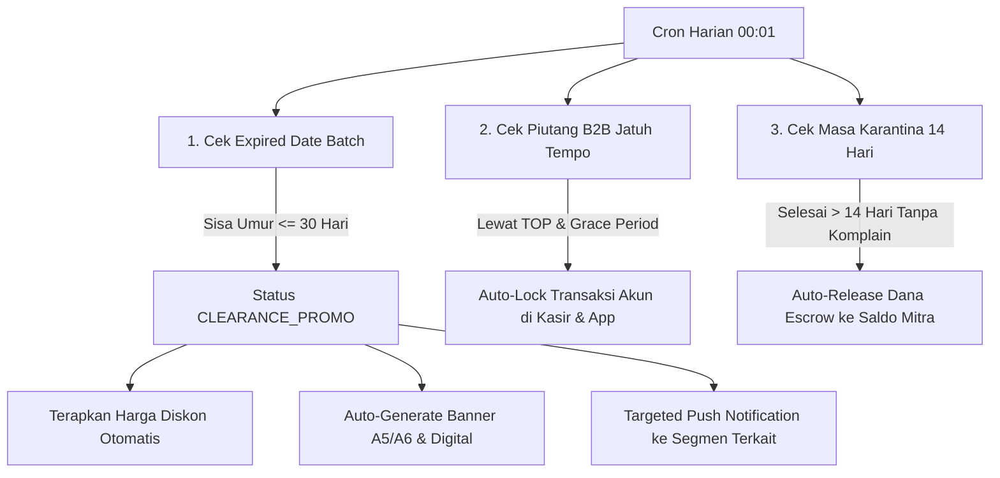
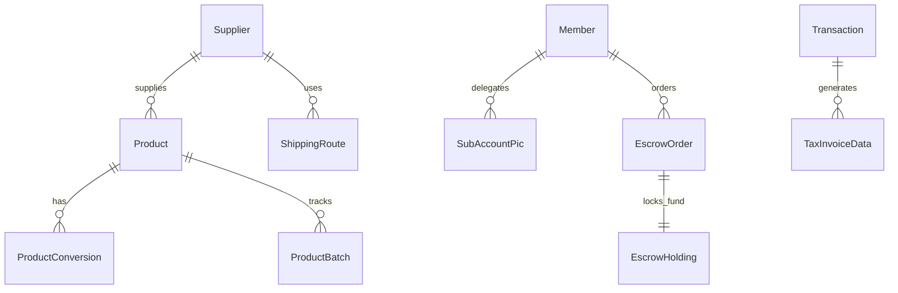

# PRODUCT REQUIREMENTS DOCUMENT (PRD)
## ORIENTAL DIGITAL ECOSYSTEM — v2.1 (Autonomous Ecosystem & Superapp Architecture)

| Metadata | Keterangan |
| :--- | :--- |
| **Nama Dokumen** | PRD Oriental Digital Ecosystem — Master Architecture & Specification Document |
| **Versi Dokumen** | 2.1.0 (Autonomous One-Person Company & Trifecta Superapp Architecture) |
| **Tanggal Diperbarui** | 26 September 2026 |
| **Status** | 🟡 Live VPS (v2.0) — Architecture Transition & Specification Phase (v2.1) |
| **Repository** | https://github.com/projectchanvb01-crypto/OrientalVB.git |
| **Production URL** | http://139.190.98.215 |
| **Filosofi Sistem** | **One-Person Autonomous Company** (Otomasi sistem penuh untuk keputusan & administrasi, operasional fisik didelegasikan ke tim) |
| **Standar Kepatuhan** | SAK Indonesia (Double-Entry Ledger), Regulasi Pajak DJP Coretax (PPN 11%), Persiapan PJP BI (Closed-Loop Wallet) |

---

## 1. Executive Summary & Visi Produk

### 1.1 Visi & Filosofi "One-Person Autonomous Company"
Membangun ekosistem perdagangan dan rantai pasok terintegrasi berbasis *One-Person Company Orchestration*. Sistem dirancang sedemikian rupa agar seluruh pengambilan keputusan bisnis (penetapan harga dinamis, clearance promo kedaluwarsa, kalkulasi logistik lintas pulau, mitigasi piutang, pelaporan pajak, hingga jurnal akuntansi) dijalankan **secara otomatis oleh aturan sistem (*Autonomous Business Rules Engine*)**, sementara tim fisik di lapangan fokus pada eksekusi operasional (kasir, gudang, penimbangan limbah, dan pengantaran).

### 1.2 Masalah yang Diselesaikan
1. **Beban Pengawasan Mikro Operasional** — Memungkinkan 1 owner memonitor dan mengontrol 3 kasir aktif, inventori, piutang, dan keuangan tanpa harus berada di lokasi fisik setiap saat.
2. **Risiko Kerugian Barang Kedaluwarsa (Expired Date)** — Mengganti pengecekan manual dengan deteksi dini sistem (FEFO), otomatisasi diskon bertingkat, dan pembuatan materi promosi instan.
3. **Kompleksitas Logistik Antar-Pulau** — Mengatasi ketidakpastian HPP riil akibat biaya ekspedisi laut melalui kalkulator kubikasi ($m^3$) dan estimasi *landed cost*.
4. **Kepatuhan Pajak B2B (DJP Coretax)** — Otomatisasi perhitungan PPN Keluaran 11% untuk pelanggan PKP yang siap dilaporkan ke sistem Coretax DJP.
5. **Fragmentasi Aplikasi** — Memecah aplikasi monolitik menjadi **Trifecta App Architecture** (Terminal POS, Superapp Konsumen/Mitra, dan Backoffice Kendali).

---

## 2. Arsitektur Trifecta Superapp & Ekosistem Aplikasi

Ekosistem tidak lagi disatukan dalam satu bundle PWA monolitik, melainkan dipecah menjadi 3 aplikasi mandiri di dalam Monorepo:

```
                            ORIENTAL MONOREPO
                                   │
      ┌────────────────────────────┼────────────────────────────┐
      ▼                            ▼                            ▼
[apps/pos]                    [apps/hub]                   [apps/admin]
Oriental POS Terminal         Oriental Superapp            Oriental Backoffice
(Khusus Kasir & Shift)        (Konsumen, UKM, Learn, Pay)  (One-Person Control Plane)
      │                            │                            │
      └────────────────────────────┼────────────────────────────┘
                                   ▼
                           [apps/api] (NestJS API)
                                   │
                 ┌─────────────────┴─────────────────┐
                 ▼                                   ▼
         [packages/database]                 [packages/types]
         (Prisma 16 Models)                  (Shared Types)
```

### 2.1 Pemetaan Aplikasi & Batasan (Boundaries Matrix)

| Dimensi | **1. apps/pos (Terminal Kasir)** | **2. apps/hub (Superapp Konsumen & Mitra)** | **3. apps/admin (Backoffice Control)** |
| :--- | :--- | :--- | :--- |
| **Target User** | • Kasir 1 & 2 (Retail/Swalayan)<br>• Kasir 3 (Grosir & UKM Supply)<br>• Operator Timbangan Waste | • Pelanggan Umum (B2C)<br>• Pemilik UKM Kuliner & Akun PIC<br>• Peserta Oriental Learn<br>• Mitra White Label | • Super Admin / Owner (One-Person)<br>• Kepala Toko / PIC Supervisor<br>• Purchasing & Staff Gudang<br>• Akuntan / Finance |
| **Karakteristik & UI** | PWA Tablet/PC, UI cepat, barcode-oriented, keyboard shortcut. | PWA Mobile-First, UI modern & interaktif, catalog & streaming. | Web Desktop Dashboard, data-dense, tabular, analitik komparatif. |
| **Toleransi Offline** | **Wajib Offline-First** (Dexie.js / IndexedDB), sinkronisasi saat online. | **Rendah/Menengah** (Online required untuk streaming & verifikasi). | **Nol (Online Only)** (Konsistensi ACID langsung ke PostgreSQL). |
| **Perangkat Keras** | Thermal 58/80mm, Dot-Matrix 3-ply, Barcode HID, Timbangan Digital. | Kamera HP (Scan QR & Bukti Terima). | Printer Kantor A4 standar. |
| **Akses Data** | Hanya membaca harga & stok; hanya menulis transaksi & rekonsiliasi kasir. | Hanya membaca katalog segmennya & materi Learn; memesan barang & jadwal limbah. | Kontrol penuh: Master data, rules otomasi, approval piutang, dan jurnal SAK. |

---

## 3. Autonomous Rules Engine (Pusat Otomasi One-Person)

Sistem menjalankan cron harian dan trigger otomatis untuk mengeliminasi pekerjaan administratif manual:



---

## 4. Spesifikasi Modul Backoffice (Internal Control Plane)

### 4.1 Master Data, Unit Konversi & Kendali Harga
*   **Unit Konversi Dinamis Tak Terbatas:** 
    *   Setiap SKU memiliki **Base Unit** (misal: Pcs) dan tabel konversi fleksibel (misal: Renceng isi 12, Bal isi 10, Dus Kecil isi 24, Karton Jumbo isi 48).
    *   Setiap satuan memiliki kode barcode opsional untuk pemindaian instan di kasir.
*   **Pusat Kendali Harga:**
    *   1 Harga Retail Umum (B2C).
    *   1 Harga Grosir Standar.
    *   **Multi-Tier Harga Segmen UKM:** Dapat ditambah secara dinamis (Hotel, Resto, Cafe, Coffeeshop, Warung Makan, Bakery, Catering).
*   **Waste Buying Rate:** Update harga harian per kg untuk komoditas limbah (jelantah, kardus, plastik, logam).
*   **Data Master Supplier:**
    *   Lokasi Asal Supplier (kota/pelabuhan) untuk integrasi logistik.
    *   **Status PKP (Ya/Tidak):** Mempengaruhi validitas Faktur Pajak Masukan (PPN 11%) dan kalkulasi HPP riil.

### 4.2 WMS, Kontrol Inventori & Landed Cost Ekspedisi Laut
*   **Tabel Umur Produk & FEFO (First Expired First Out):**
    *   🟢 **Level Hijau (> 90 Hari):** Kondisi aman, stok disimpan di buffer gudang.
    *   🟡 **Level Kuning (31–90 Hari):** Masuk rak prioritas keluar kasir.
    *   🔴 **Level Merah (≤ 30 Hari):** Memicu *Autonomous Promo Engine* & Auto-Banner.
*   **Kalkulator Logistik Antar-Pulau (Landed Cost CBM):**
    *   Rumus Volume: $\text{CBM} = \frac{P (\text{cm}) \times L (\text{cm}) \times T (\text{cm})}{1.000.000}$.
    *   Master Tarif Ekspedisi Laut per Rute (contoh: Surabaya–Makassar tarif per $m^3$ + port handling).
    *   Otomatis membagi total ongkir ke HPP satuan barang sebelum PO diterbitkan.
*   **Supplier Comparison Engine:** Membandingkan 1 SKU dari beberapa supplier (harga, status PKP, ongkir laut, dan lead time) untuk menentukan pilihan paling menguntungkan.
*   **PO, GRN & Stock Opname:** Penerimaan fisik wajib mencatat tanggal kedaluwarsa dan nomor batch.

### 4.3 Kasir, Shift & Pengawasan Uang Fisik (3 Kasir Aktif)
*   **Approval Modal Awal:** Kasir 1, 2, dan 3 wajib meminta persetujuan Kepala Toko/PIC (PIN/Kartu) sebelum memulai transaksi.
*   **Live Cash Drawer Monitor:** Pemantauan nominal uang kas fisik di laci tiap kasir secara real-time.
*   **Nominal Cash Drop Fleksibel:** Superadmin dapat mengubah batas maksimal uang di laci (misal: jika kas tembus Rp 3.000.000, kasir diwajibkan melakukan setor brankas).
*   **Blind Closing & Selisih Kas:** Kasir menghitung uang fisik tanpa melihat angka sistem; selisih kas (short/over) otomatis tercatat di dashboard dan memicu jurnal penyesuaian SAK.
*   **Supervisor Override:** Hak otorisasi Kepala Toko untuk transaksi khusus (void, refund, diskon darurat).

### 4.4 B2B Credit, Piutang (AR) & Pajak DJP Coretax
*   **Credit Limit & TOP Dinamis:** Setting batas nominal dan durasi termin (7, 14, 30, 45 hari) per segmen UKM dengan hak *One-Click Override* oleh Superadmin.
*   **Aging Schedule (Umur Piutang):** Pemantauan piutang lancar, 1–30 hari, hingga macet.
*   **Pelunasan Nota:** Wajib melampirkan foto struk transfer bank/cek giro saat penginputan pelunasan.
*   **Auto-Lock Transaksi:** Akun yang melewati jatuh tempo otomatis terkunci dari kasir dan pemesanan aplikasi.
*   **Perhitungan Pajak Keluaran (PPN 11%) untuk Pelanggan PKP:**
    *   Otomatis memisahkan nilai DPP dan PPN 11% pada faktur B2B.
    *   Jurnal otomatis akuntansi ke akun `2-2001 (Utang PPN Keluaran)`.
    *   Tersedia tab **"Pajak Keluaran Siap Lapor Coretax"** dengan kolom yang sudah sesuai standar impor sistem Coretax DJP.

### 4.5 Accounting SAK Komprehensif
*   **Jurnal Pengeluaran Manual (OPEX):** Form pencatatan cepat beban gaji, bensin, listrik, sewa, dan perawatan.
*   **Laporan Finansial Multi-Komparasi:**
    *   **MoM (Month-on-Month):** Bulan berjalan vs bulan sebelumnya.
    *   **YoY (Year-on-Year):** Bulan berjalan vs bulan yang sama tahun lalu.
    *   **Laporan Semesteran & Tahunan.**
    *   **Daily Drilldown:** Filter perbandingan kinerja omzet harian.
*   **Tutup Buku Periode:** Mengunci buku besar agar transaksi lampau tidak dapat dimanipulasi.

---

## 5. Spesifikasi Oriental Superapp (`apps/hub`)

### 5.1 Akun Induk UKM & Delegasi PIC
*   **Hierarki Akun B2B:**
    *   *Akun Induk (Owner UKM):* Mengatur limit belanja, metode pembayaran (TOP/Cash), dan hak otorisasi.
    *   *Akun Delegasi (Chef / Barista / Purchasing):* Memiliki login khusus untuk membuat keranjang pesanan bahan baku dan mengatur jadwal jam kirim.
*   **Penjadwalan Pengantaran:** Pilihan jadwal kirim reguler atau standing order harian/mingguan.
*   **Fitur Jemput Limbah (Waste Pickup on Demand):** UKM mengajukan request penjemputan minyak jelantah/kardus langsung dari aplikasi.

### 5.2 Oriental Learn (USP Edukasi Pelanggan)
*   **Kurikulum Terstruktur:** Kursus video digital (SOP dapur, teknik barista, manajemen HPP warung).
*   **Materi & Kuis:** Download modul PDF dan ujian kuis otomatis.
*   **Pemesanan Workshop Offline:** Registrasi tempat duduk kelas offline dengan QR check-in.
*   **E-Sertifikat Digital:** Sertifikat kelulusan terverifikasi QR untuk standar mitra UKM.

### 5.3 Oriental Pay (Dompet Ekosistem & Ledger Siap Regulasi)
*   **Fase 1 (Closed-Loop Stored Value):** 
    *   Menampung reward poin belanja, komisi referral, dan saldo hasil penjualan limbah.
    *   Hanya dapat dibelanjakan kembali di ekosistem Oriental (Kepatuhan PBI tanpa izin e-money open-loop).
    *   Pencatatan menggunakan *double-entry audit trail* ke akun liabilitas `2-1050 (Titipan Saldo Oriental Pay)`.
*   **Fase 2 (Open-Loop PJP):** Kesiapan arsitektur API untuk integrasi co-branding dengan penyedia jasa pembayaran berlisensi (PJP).

### 5.4 Ekosistem Mitra White Label (Model Escrow 14 Hari)
*   Mitra White Label memiliki portal akun khusus di Superapp.
*   **Alur Managed Direct-Fulfillment:**
    1. Konsumen memesan produk White Label via Oriental Superapp.
    2. Dana pembayaran ditampung di rekening escrow Oriental Ecosystem.
    3. Mitra menerima order dan mengantar pesanan langsung ke konsumen.
    4. Status pengantaran terupdate di Superapp hingga konsumen konfirmasi terima.
    5. **Masa Karantina Kualitas (14 Hari):** Dana tertahan di sistem untuk menjamin kualitas produk.
    6. Setelah 14 hari tanpa dispute/komplain, dana otomatis dicairkan ke saldo mitra.

---

## 6. Spesifikasi Terminal Kasir (`apps/pos`)

*   **Multi-Lane Setup:**
    *   **Kasir 1 & 2 (Retail/Swalayan):** Quick scan barcode, multi-payment (Tunai, QRIS Dinamis, Transfer), cetak thermal 58/80mm, banner promo amber.
    *   **Kasir 3 (Grosir & UKM Supply):** Input partai besar, auto-tier harga UKM, pengecekan limit kredit TOP, kalkulasi PPN 11% untuk pelanggan PKP, cetak nota 3 rangkap dot-matrix (L1 Putih, L2 Kuning, L3 Biru).
    *   **Kasir Limbah (Waste Counter):** Input berat kg, harga pasar dinamis, foto timbangan, auto-credit saldo ke akun member.
*   **Integritas Kasir:** Shift ID unik, input modal awal terotorisasi, warning cash drop, dan formulir blind closing.

---

## 7. Autonomous HR & Payroll Architecture (Roadmap / Coming Soon)

Modul otomatisasi ketenagakerjaan untuk mendukung konsep *One-Person Company*:
*   **Presensi Terintegrasi POS:** Jam masuk dan keluar staf kasir/gudang terikat langsung dengan sesi buka-tutup terminal kasir.
*   **Kalkulasi Gaji Otomatis:** Sistem menghitung gaji pokok, komisi target, uang lembur, dan penyesuaian potongan selisih kas minus.
*   **Slip Gaji Digital & Jurnal SAK:** Pembuatan slip gaji otomatis dan penjurnalan langsung ke beban gaji tanpa input manual.

---

## 8. Database Schema Updates (Prisma PostgreSQL 16)

Untuk mendukung pembaruan v2.1, model Prisma diperluas dengan entitas baru:



### Entitas Tambahan Utama:
1. `ProductConversion`: `id, productId, unitName, multiplierQty, barcode, isDefaultB2b`
2. `ProductBatch`: `id, productId, batchNumber, expiryDate, stockQty, warningLevel`
3. `Supplier`: `id, name, locationCity, isPkp, npwp, leadTimeDays`
4. `ShippingRoute`: `id, supplierId, originPort, destinationPort, ratePerCbm, minCbm, handlingFee`
5. `SubAccountPic`: `id, memberParentId, picName, phone, rolePermission`
6. `EscrowHolding`: `id, transactionId, partnerId, totalAmount, holdUntilDate, status (HOLDING, RELEASED, DISPUTED)`
7. `TaxInvoiceData`: `id, transactionId, customerNpwp, customerTaxName, dppAmount, ppnAmount, coretaxExported`
8. `CashierShift`: `id, cashierUserId, terminalId, openingCash, approvedByPicId, closingCashPhysical, discrepancyAmount`

---

## 9. Roadmap Pengembangan Bertahap (Sprint Transition)

| Milestone | Sasaran Utama | Target Deliverable |
| :--- | :--- | :--- |
| **Sprint 8** | **WMS FEFO & Auto-Promo Engine** | Tracking batch expired, warning level (Green/Amber/Red), auto-diskon, dan auto-generate banner promosi fisik/digital. |
| **Sprint 9** | **Logistik CBM & Jembatan Pajak Coretax** | Kalkulator landed cost CBM laut, status supplier PKP, dan ekspor faktur keluaran PPN 11% format Coretax. |
| **Sprint 10**| **Pemisahan Frontend (Trifecta Split)** | Pemisahan monorepo menjadi `apps/pos`, `apps/hub`, dan `apps/admin`. |
| **Sprint 11**| **Superapp Hub & Oriental Learn (USP)** | Portal kursus video, modul kuis, e-sertifikat QR, dan delegasi akun PIC UKM. |
| **Sprint 12**| **White Label Escrow 14 Hari & Pay Ledger** | Sistem holding dana pesanan mitra 14 hari dan buku besar saldo tertutup Oriental Pay. |
| **Phase 3**  | **Autonomous HR & Payroll Module** | Presensi POS, auto payroll slip, dan penjurnalan beban gaji SAK. |

---

> [!NOTE]
> Seluruh arsitektur di atas dirancang untuk memaksimalkan efisiensi satu pengambil keputusan (*One-Person Control Plane*) menggunakan infrastruktur VPS tunggal Ubuntu LTS, PostgreSQL 16, Redis BullMQ, MinIO, dan NestJS.

---
*Dokumen ini merupakan Master PRD v2.1 resmi untuk Oriental Digital Ecosystem.*
